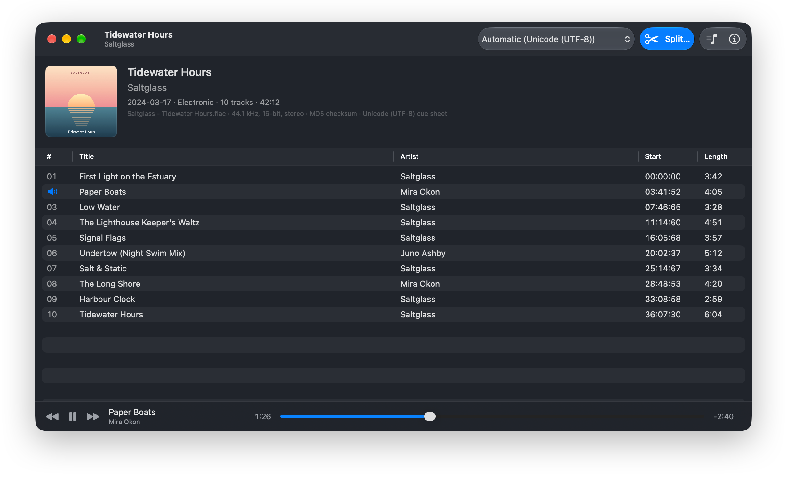

<!-- Generated from Distribution/release-repo/README.md in the CueSplit repository on each release; edit it there. -->
<h1 align="center">CueSplit</h1>

<p align="center">
  Split single-file lossless albums into tagged tracks, on the Mac.
</p>

<p align="center">
  
</p>

CueSplit opens a CD image rip (a cue sheet plus one FLAC or APE file for the whole album) and turns it into one
tagged file per track: FLAC, Apple Lossless or AAC. Use the Mac app to check the names and tags, listen, and split,
or `cuesplit` on the command line for scripts and batches.

## Download

| | Homebrew | Or download from [Releases](../../releases/latest) |
|---|---|---|
| **CueSplit**, the Mac app | `brew install galaco/tap/cuesplit` | `CueSplit-<version>.dmg`: open it and drag CueSplit to Applications |
| **cuesplit**, the command-line tool | `brew install galaco/tap/cuesplit-cli` | `cuesplit-<version>-macos.zip`: unzip it and put `cuesplit` on your `PATH` |

Both are free, run on macOS 14 or later on Apple silicon and Intel Macs, and are signed and notarized by Apple.
`brew upgrade` keeps Homebrew installs up to date; downloads from Releases don't update themselves. Homebrew
also installs the command-line tool's man page (`man cuesplit`) and completions for zsh, bash and fish.

## The app

- **Any cue sheet:** reads cue sheets in Unicode, Japanese (Shift-JIS, EUC-JP), Chinese (GB18030, Big5), Korean,
  Cyrillic and Western encodings, and detects which one a sheet uses. If names still look garbled, switch
  encodings and see the result straight away.
- **Keeps your metadata:** tags come from the cue sheet and the image file, including foobar2000-style per-track
  tags and the cover art.
- **Edit before you split:** change any tag for the whole album or the selected tracks, replace the cover art,
  and listen to any track.
- **Checks its work:** source files are checked against their MD5s, and every saved track is verified against
  the original audio.
- **Add to Music:** add the album, or a few tracks, to your Music library as Apple Lossless or AAC.

Drop a cue sheet on the window (or a FLAC or APE file with an embedded cue sheet), check the track list, and
click **Split…**.

## The command-line tool

```sh
cuesplit album.cue                     # FLAC tracks in "Artist - Album" next to the cue sheet
cuesplit album.cue -o ~/Music --alac   # Apple Lossless, in ~/Music/Artist - Album
cuesplit */*.cue --aac -b 256          # several albums as 256 kbps AAC
cuesplit album.cue --tracks 3,5        # only some tracks
cuesplit album.cue --dry-run           # list the files it would save
cuesplit info album.cue                # show the tracks and tags without splitting
```

The input can also be a FLAC or APE file with an embedded cue sheet.

| Option | |
|---|---|
| `--flac`, `--alac`, `--aac` | Output format. FLAC is the default; Apple Lossless and AAC are `.m4a` files that play in Music. |
| `-b`, `--bitrate <kbps>` | AAC bit rate: 128, 160, 192, 224, 256 (the default, Apple Music's) or 320. |
| `-o`, `--output <folder>` | Where to save. Defaults to each cue sheet's folder. |
| `--no-album-folder` | Save straight into the output folder instead of an "Artist - Album" folder. |
| `--tracks <list>` | Only these tracks, e.g. `3` or `1,4-6`. |
| `--overwrite` | Replace existing files. Without it, cuesplit refuses to overwrite anything. |
| `--encoding <name>` | The cue sheet's text encoding, if the guess is wrong (`cuesplit encodings` lists them). |
| `--gaps`, `--hidden-track` | Where pregaps and audio before track 1 go. |
| `--jobs <n>` | Tracks to encode at once. |

`cuesplit help split` lists every option.

### In scripts

The paths of saved files go to standard output, one per line; progress and warnings go to standard error. `-q`
hides progress.

`--json` prints the results instead:

```json
{
  "albums" : [
    {
      "error" : null,
      "files" : [
        "/Music/Saltglass - Tidewater Hours/01 - First Light on the Estuary.flac",
        "/Music/Saltglass - Tidewater Hours/02 - Paper Boats.flac"
      ],
      "input" : "album.cue",
      "output" : "/Music/Saltglass - Tidewater Hours/",
      "warnings" : []
    }
  ]
}
```

Every field is always present: `error` is null for an album that succeeded, and `output` is null if cuesplit
couldn't read the album.

`cuesplit info album.cue --json` describes the album: the encoding it detected, the source files, and every track
with its start, length, file name and tags.

Exit status: 0 on success, 1 if any album failed (the others are still split), 64 for invalid arguments.

## Feedback and support

Report bugs and ideas in [Issues](../../issues). For a cue sheet that CueSplit reads wrongly, please attach the
`.cue` file. You can also [email me](https://galaco.me/software/support-and-contact).

Neither the app nor the command-line tool collects any data or connects to the internet; see the
[privacy policy](https://galaco.me/software/privacy-policy).

## License

MIT; see [LICENSE](LICENSE). CueSplit includes libFLAC and the Monkey's Audio SDK (both BSD-3-Clause), and the
command-line tool also Swift Argument Parser (Apache 2.0). Their notices are in the app's About window and in
`THIRD_PARTY_NOTICES.txt` in the command-line tool's download.
